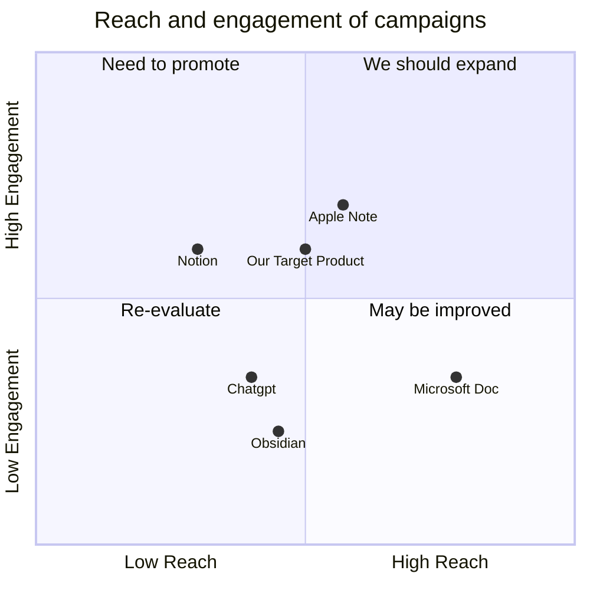

## Original Requirements
The boss has identified a gap in the market for a more advanced and intuitive prompt engineering tool. Existing tools such as Notion, Obsidian, Apple Note, Microsoft Doc, and other prompt websites are deemed too basic and hard to manipulate. The boss wants a tool that is designed to work with AI, not just talk to it. 

The new tool should revolutionize the traditional word processing workflow of draft, edit, format to a more dynamic draft, test, edit, iterate process. The tool should be innovative and powerful, capable of harnessing the unbounded creativity and infinite possibilities of AI. 

Key features of the tool should include:

1. A layout and interface similar to Xmind and Obsidian .md style. Users should start with a clean canvas, not an empty document. Each canvas should be a folder where users can add files, drawings, pdf, pngs, etc. 

2. The ability to link blocks to create a stack. This will allow users to iterate each part separately and easily stack them up to create a new prompt. 

3. A Github-like commit and doc history tracking system. When a block is changed, users should be prompted with an option to commit to the change. This will store both the past version of the block and the new block. 

## Product Goals
```python
[
    "Create an advanced and intuitive prompt engineering tool",
    "Design the tool to work with AI, not just talk to it",
    "Incorporate a Github-like commit and doc history tracking system"
]
```

## User Stories
```python
[
    "As a user, I want to start with a clean canvas, not an empty document, so I can freely add files, drawings, pdf, pngs, etc.",
    "As a user, I want to be able to link blocks to create a stack, so I can iterate each part separately and easily stack them up to create a new prompt.",
    "As a user, I want a Github-like commit and doc history tracking system, so I can keep track of all changes made to a block."
]
```

## Competitive Analysis
```python
[
    "Notion: A popular note-taking and productivity app, but lacks advanced AI integration and prompt engineering capabilities.",
    "Obsidian: A powerful knowledge base that works on top of a local folder of plain text Markdown files, but lacks AI integration.",
    "Apple Note: A basic note-taking app with limited features and no AI integration.",
    "Microsoft Doc: A traditional word processing tool with limited AI capabilities.",
    "Chatgpt: A prompt website with basic features and hard to manipulate interface."
]
```

## Competitive Quadrant Chart


## Requirement Analysis
The product should be a prompt engineering tool with advanced AI integration. It should have a layout and interface similar to Xmind and Obsidian .md style, with the ability to link blocks to create a stack. It should also have a Github-like commit and doc history tracking system.

## Requirement Pool
```python
[
    ("Create a clean canvas where users can add files, drawings, pdf, pngs, etc.", "P0"),
    ("Develop a system to link blocks to create a stack", "P0"),
    ("Incorporate a Github-like commit and doc history tracking system", "P0"),
    ("Design the tool to work with AI, not just talk to it", "P0"),
    ("Ensure the tool is user-friendly and intuitive", "P1")
]
```

## UI Design draft
The UI should be clean and intuitive, similar to Xmind and Obsidian .md style. The main screen should be a canvas where users can add files, drawings, pdf, pngs, etc. There should be a sidebar for linking blocks to create a stack. There should also be a commit button that prompts users to save changes when a block is altered.

## Anything UNCLEAR
There are no unclear points.