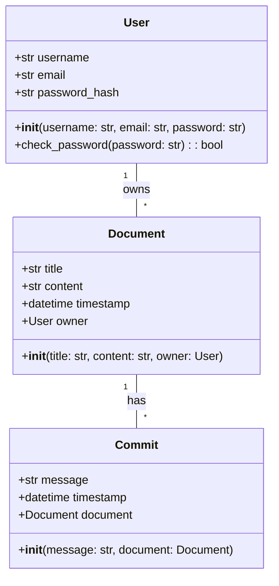
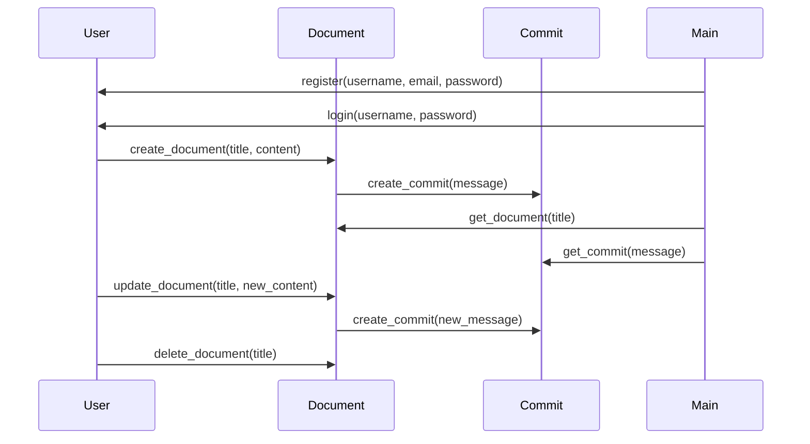

## Implementation approach
We will use Flask for the backend to handle requests and responses. For the frontend, we will use ReactJS to create a dynamic and responsive user interface. We will use SQLite for the database to store user data and document history. For AI integration, we will use the OpenAI GPT-3 API. For the Github-like commit and doc history tracking system, we will use GitPython, an open-source library that provides Git functionalities. For testing, we will use pytest, an open-source testing framework.

## Python package name
```python
"ai_prompt_tool"
```

## File list
```python
[
    "main.py",
    "app/__init__.py",
    "app/routes.py",
    "app/models.py",
    "app/forms.py",
    "app/static/styles.css",
    "app/templates/index.html",
    "app/templates/layout.html",
    "app/templates/login.html",
    "app/templates/register.html",
    "app/templates/canvas.html",
    "tests/test_routes.py",
    "tests/test_models.py"
]
```

## Data structures and interface definitions


## Program call flow


## Anything UNCLEAR
The requirement is clear to me.